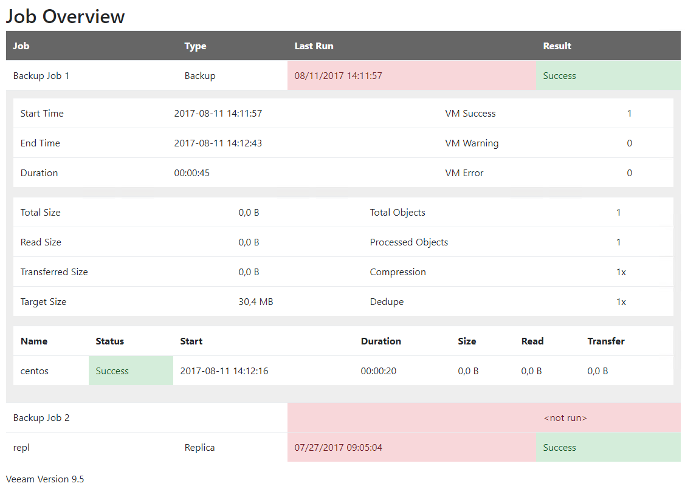

# Installing
Does require the veeam powershell module to be installed and powershellstart (later will be downloaded as well)
```powershell
iex $(wget 'https://raw.githubusercontent.com/tdewin/randomsamples/master/powershell-veeamallstat/bootstrap.ps1').content
```

# Using
GUI
```powershell
Import-module veeamallstat
Connect-VeeamAllStat
```

Via code
```powershell
Import-module veeamallstat
Add-pssnapin veeampssnapin
Connect-VBRServer -server $server -Credential  $credentials
New-VeeamAllStatReport
```

Build your own
```powershell
Import-module veeamallstat
Add-pssnapin veeampssnapin
Connect-VBRServer -server $server -Credential  $credentials
$stats = Get-VeeamAllStat
$stats
```

Once installed, you can make a shortcut
```
C:\Windows\System32\WindowsPowerShell\v1.0\powershell.exe -WindowStyle Hidden -c "Import-module veeamallstat;connect-veeamallstat"
```
* Set your working directory to something else than c:\windows\... though so that your report is generated somewhere where you can find (for example %desktop%)
* Put run on minimized
* You can set the icon to '%ProgramFiles%\Veeam\Backup and Replication\Console\veeam.backup.shell.exe' to get a nice shiny Veeam icon


# Screenshots

